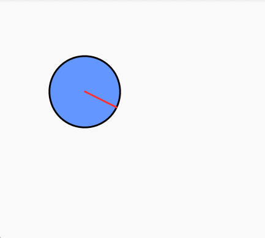

# 🌀 Movimiento Circular con Transformaciones en Processing
Este sketch en Processing muestra una figura geométrica (una elipse) que se mueve en un trayecto circular, se escala de forma ondulada y gira como una rueda. Se utilizan transformaciones como translate(), rotate() y scale() junto con funciones como sin() y cos() para animar el movimiento en el tiempo.

📌 Funcionalidades implementadas
🔄 Transformaciones: uso de translate(), rotate(), y scale().

🔃 Aislamiento de transformaciones: con pushMatrix() y popMatrix().

🕒 Animación temporal: utilizando millis() y sin() para variación en el tiempo.

🛞 Simulación de una rueda: el objeto gira sincronizado con su trayecto circular.

💨 Movimiento suave: gracias a las funciones trigonométricas.

## Preview

