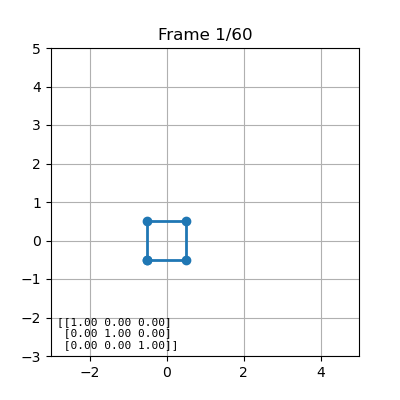

# 2D Shape Transformation Animation

Este proyecto crea una animación de una forma 2D (un cuadrado) que experimenta tres transformaciones: traslación, rotación y escalado, interpoladas en el tiempo. La animación es generada utilizando Python y librerías como numpy, matplotlib y imageio.

## 🖼 Descripción del Proyecto

Este script toma un cuadrado ubicado en el origen y aplica una secuencia de transformaciones en 60 frames. Estas transformaciones incluyen:

Traslación: Movimiento del cuadrado de un punto inicial a uno final.

Rotación: Rotación del cuadrado desde un ángulo inicial hasta un ángulo final.

Escalado: Cambio en el tamaño del cuadrado, aumentando o reduciendo su escala.

Cada transformación es interpolada para cambiar suavemente entre los valores iniciales y finales durante la animación.

## 🛠 Funciones Clave

Matrices de transformación:

translation_matrix(tx, ty): Genera la matriz de traslación 3x3 para mover el objeto.

rotation_matrix(theta): Genera la matriz de rotación 3x3 para rotar el objeto en un ángulo dado en radianes.

scaling_matrix(sx, sy): Genera la matriz de escala 3x3 para modificar el tamaño del objeto.

Interpolación de parámetros:

Traslación: Se calcula interpolando entre las coordenadas de inicio (x0, y0) y fin (x1, y1).

Rotación: Se interpola entre los ángulos de inicio (theta0) y fin (theta1).

Escalado: Se interpola entre los factores de escala de inicio (s0) y fin (s1).

Animación:

Se genera una lista de frames interpolados y transformados, que luego se convierten en una animación en formato GIF.

## 🧑‍💻 ¿Cómo funciona?

Se define un cuadrado con coordenadas en 2D.

Se crean funciones para generar las matrices de transformación correspondientes (traslación, rotación y escalado).

Se interpolan estos parámetros a lo largo de los frames definidos (num_frames), creando una animación de 60 frames.

La animación se guarda como un archivo GIF que muestra el cambio de forma en cada frame.

## Preview
