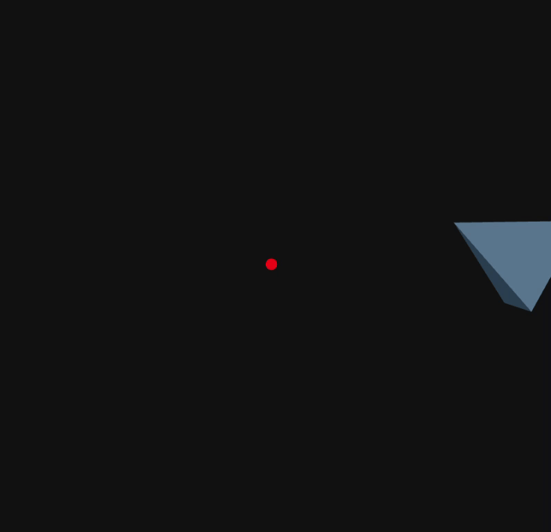

🌐 Proyecto en React Three Fiber
Este proyecto ilustra cómo realizar transformaciones 3D mediante Three.js integrado con React Three Fiber.

🔺 Escena con animación
En la escena se encuentra un objeto 3D (un tetraedro) que realiza las siguientes acciones:

🔁 Rotación continua alrededor de su eje Y.

🌍 Órbita circular alrededor del origen utilizando las funciones Math.cos(t) y Math.sin(t).

💡 Iluminación proporcionada por una luz ambiental y una luz direccional.

🧭 Interactividad con la cámara a través de OrbitControls, permitiendo rotarla, hacer zoom y moverla libremente.

Además, una esfera roja en el centro de la escena indica el origen para facilitar la referencia.

🛠 Conceptos importantes
El Canvas de @react-three/fiber es responsable de renderizar la escena 3D.

useFrame() actualiza la animación en cada renderizado del frame.

useRef() se utiliza para hacer referencia y modificar el objeto 3D.

OrbitControls permite la interacción con la cámara en tiempo real.

Las luces se configuran utilizando ambientLight y directionalLight.

## 🎞️ Preview

