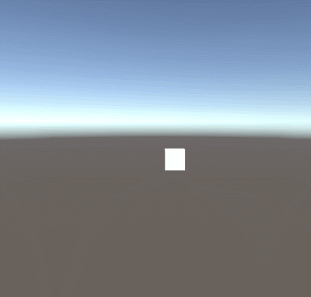

# RandomTransform

Este proyecto de Unity demuestra cómo combinar tres tipos de transformaciones en un mismo componente: traslación aleatoria suave, rotación constante y escalado oscilante.

 📋 Descripción de las implementaciones

## Traslación aleatoria suave

Cada translationInterval segundos se elige una nueva dirección (eje X o Y) con una distancia aleatoria entre -translationDistance y translationDistance.

Se calcula una velocidad (translationVelocity) dividiendo la distancia por el intervalo y se aplica progresivamente con transform.Translate(velocity * Time.deltaTime, Space.World).

## Rotación constante

Aplica en cada frame transform.Rotate(rotationSpeed * Time.deltaTime, Space.Self).

rotationSpeed es un Vector3 en grados por segundo para cada eje.

## Escalado oscilante

Usa Mathf.Sin(Time.time * scaleFrequency) para generar un factor oscilante.

Ajusta la escala relativa a la original con transform.localScale = originalScale * (1 + scaleAmplitude * sin(...)).

## Preview

