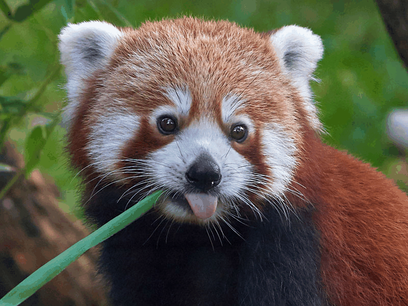

# Proyecto Final - Procesamiento de Imágenes en Python

## Punto 1 – Python

### Descripción

Este proyecto se enfoca en la aplicación de técnicas de procesamiento de imágenes utilizando Python. Se trabaja con una imagen de un animal en peligro de extinción y se realizan diversas manipulaciones y análisis sobre ella. Los pasos incluyen la carga y visualización de la imagen original, la aplicación de filtros básicos, la separación en canales de color, la realización de operaciones morfológicas y la creación de una animación para visualizar los cambios aplicados a la imagen.

### Objetivos

1. **Carga y visualización de la imagen RGB:** Se carga la imagen de un animal en peligro de extinción y se muestra.
2. **Aplicación de filtros básicos:** Se aplican filtros de suavizado/desenfoque y realce de bordes, mostrando los resultados y comentando los efectos visuales observados.
3. **Visualización de canales de color:** Se separan los canales R, G y B de la imagen y se visualizan en escala de grises, explicando las diferencias observadas en cada canal.
4. **Operaciones morfológicas:** Se aplica un par de operaciones morfológicas en una versión binarizada de la imagen, comparando los resultados con la imagen original.
5. **Animación:** Se crea una animación en formato GIF para mostrar los efectos de los filtros y las operaciones morfológicas.

### Entregables

1. **examen_final_python.ipynb**: Notebook en Python con todo el proceso de análisis de imágenes y los comentarios explicativos.
2. **Carpeta `data/`**: Contiene las imágenes usadas en el análisis.
3. **Carpeta `gifs/`**: Contiene los GIFs generados que muestran los efectos antes y después de los filtros y las operaciones morfológicas.

### Visualización de los GIFs

A continuación se presenta el GIF generados durante el proceso:

   

### Explicación de los GIFs

Los GIFs generados muestran los resultados de los filtros aplicados y las operaciones morfológicas sobre la imagen de un animal en peligro de extinción. En el primer GIF, se puede observar el impacto de los filtros de suavizado y realce de bordes. El suavizado reduce el ruido y hace que la imagen sea más suave, mientras que el realce de bordes destaca los contornos y las estructuras más prominentes.

El segundo GIF compara la imagen original con los resultados de las operaciones morfológicas aplicadas sobre una versión binarizada de la imagen. Las operaciones morfológicas, como la dilatación y la erosión, afectan la estructura de los objetos en la imagen, ampliando o reduciendo las áreas de interés, lo que puede ser útil para detectar formas o mejorar el contraste entre los objetos y el fondo.

### Requisitos

- Python 3.x
- Librerías: `numpy`, `opencv`, `matplotlib`, `scikit-image`

### Instrucciones de Ejecución

1. Clona el repositorio o descarga los archivos.
2. Asegúrate de tener las dependencias necesarias instaladas:
    ```bash
    pip install numpy opencv-python matplotlib scikit-image
    ```
3. Ejecuta el archivo `examen_final_python.ipynb` para visualizar el análisis completo y los resultados.


### 2. Punto 2 – Three.js (escena 3D)

Este proyecto funciona como una página web estática que utiliza Three.js y OrbitControls cargados desde un CDN mediante `importmap`, por lo que no requiere compilación ni el uso de bundlers.

#### Ejecución con un servidor local simple (Python)

1. Entra en la carpeta `threejs`:
   ```bash
   cd examen_final/threejs
2. Inicia un servidor HTTP básico:

   ```python
   python -m http.server 8000
   ```

3. Abre tu navegador en:
   ```bash
   http://localhost:8000
   ```

4. Deberías visualizar la escena 3D con:
- Un piso texturizado.
- Un cubo, una esfera, un cilindro y un cono.
- Animaciones aplicadas a los objetos.
- Un botón “Cambiar cámara” para alternar la vista.
- Controles de rotación y zoom con el mouse mediante OrbitControls.

#### Alternativa: ejecución con Live Server (VS Code)
1. Abre la carpeta del proyecto en VS Code:
    - `examen_final/threejs/`
2. Instala la extensión **Live Server** si aún no la tienes.
3. Haz clic derecho sobre `index.html` y selecciona **“Open with Live Server”**.

4. El navegador se abrirá automáticamente mostrando la escena lista para interactuar.

